<script src="https://cdn.mathjax.org/mathjax/latest/MathJax.js?config=TeX-AMS-MML_HTMLorMML"
    type="text/javascript"></script>
<script type="text/x-mathjax-config">
        MathJax.Hub.Config({
            tex2jax: {
            skipTags: ['script', 'noscript', 'style', 'textarea', 'pre'],
            inlineMath: [['$','$']]
            }
        });
</script>

<script type="module">
    import mermaid from 'https://cdn.jsdelivr.net/npm/mermaid@10.0.2/+esm';
    mermaid.initialize({ startOnLoad: false , darkMode: true});
    await mermaid.run({
        querySelector: '.language-mermaid',
    });
</script>

# Lecture 1: Introduction to C and C++

_Author: GUO, Zilin; ZOU, Hetai_
_Date: September 23, 2023_

## Overview

_Note: you need to go through the section with the flag "Mandatory", for they are essential to your embedded development skills._

### [Why do we program? (Optional)](#why-we-program)

### [Understanding Programming Languages (Optional)](#understanding-programming-language)

### [Introduction to Our Tool Chain (Mandatory)](#introduction-to-our-tool-chain)

### [Say 'Hello world' to the Embedded System(Mandatory)](#say-hello-world-to-the-embedded-system)

### [Data Types](#data-types-1)

### Why do we program？

From my own perspective (but may not be totally correct), programming itself is not the reason why we need to program.

**It is just a method, not the ultimate goal.**

Our poetic soul might eulogize for the tragedy and chant for the fortune that unexpectedly bumped into our life. These are not preferred by our reasoning mind. For this part rooted deeply in our personality, we are deliberately eager to <u>recognize</u>, <u>understand</u>, <u>calculate</u>, and ultimately propose a **workable solution**.
It would be better to illustrate it as an example.
Suppose you have successfully passed through our recruitment and become an official software member. Before you could take any relaxation, your embedded PIC abruptly assigned you the task of writing the codes for the team's **'Standard Infantry Robot'** with **other team members** in Season 2024.

What? What is the Infantry Robot? You and your teammates totally have no idea. Suppose you really want to achieve something BIG in this team, you start to brainstorm and work out the solution to complete this task by yourselves.

#### To Recognize

Your course and assignment might point you out the problem you need to solve, but real life does not. The only few words you are informed from PIC is "Write codes for the **Standard Infantry robot**".
So your first question might be "What is the Infantry Robot". After hours of googling, you might be able to find the relevant descriptions from the official documents of RoboMaster.

> The RoboMaster 2023 University Championship (“RMUC 2023”) will take place mainly in a **shooting** battle format between robots. Participating teams are required to design, develop, and create multiple robots in compliance with specifications to form a robotic team. During a seven-minute round, each of **both teams strives to destroy the other’s base through tactical combat to win the match.**
_——RoboMaster 2023 University Championship Rules Manual V2.0 (20230713), 1.1.1_

> Standard Robots can launch **17mm projectiles**.
> _——RoboMaster 2023 University Championship Rules Manual V2.0 (20230713), 3.2_

To understand it more, you need to make a deeper investigation into the specific concepts.
However, after our first-round  research, you might have a rough outline of our direction:

- We are participating in a tactical, robotic, and team-collaborating combat game.
- The game rules are similar to the MOBA game. The final goal is to destroy the enemy's base.
- The "Standard Infantry Robot" shoots 17mm projectiles to attack a specific target.

**You and your members' vocations are to achieve the basic functions of the “Infantry Robot" in the software area to win the game.**

#### To Understand and Interpret

At first glance at the occurring problems or tasks, you might find that it is so sophisticated that it seems there is no way to start. It is essential to simplify them in different ways.

**Decomposition and Deduction: Break down a big difficult problem into many small but easy-to-work-out problems.**

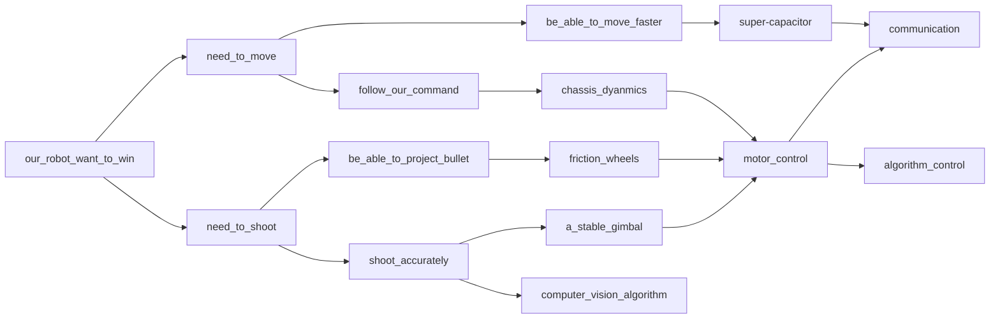

- It's easy to find all of our irrelevant sub-problems to some degree ultimately terminate at the nodes ``communication`` and ``algorithem_control``. Intrinsically, they are the utmost fundamental.

**Abstraction: Ignore the irrelevant details and focus on the main aspect of the research problems**

There are so many variables in this dazzling world. You will find that you only need to take care of what we are really **interested** in.

**Take the motor as an example**

- Motor, regardless of the specific types, are rotating kinetic units, that we are able to input our command (current / voltage), and get the output torque.
- Some motors could also send us feedback on their status.
- We need to communicate (transmit/receive messages) with the motor. The module specified for this job is called **drivers**
- **Hence, for all the motor control parts, no matter if it is on the gimbal, chassis, or shooter, you are able to replicate the same pattern. This will save you time!!**

Abstraction helps us **reduce our recognition cost** and focus on the main part of given problems. You will get familiar with this philosophy everywhere in the following days.

#### To Calculate

Followed by the successful simplification and the decomposition, we launch our ultimate offense to our problem. Now we can finally start to program.

1. Algorithm: Requires some mathematical thought and tools to solve modeled problems efficiently.

- For example, for a close-loop control, you might want to use some methods like PID, which we will cover in Lecture 7.

2. Flow: The logic and the process of how the algorithms are organized and flow. It is the skeleton.

Enjoy your programming life with your teammates!

#### Recap

In our tutorial session, we will only cover the "programming" part, which is typically the last step that we solve our problem, as mentioned above.

However, the remaining parts are undoubtedly the most important sessions. These are the **"methodology"** lying behind those codes row after row.

That is why I want to emphasize them. To some degree, they are **superior** to your coding and syntax skills. You might not completely accept my opinions, and it's OK. But I have to emphasize that, whenever you start to program, your own **methodology** ought to run through your codes. It shows your perception of how you examine the problems.

Programming is not limited to the screen. It's about life.

### Understanding Programming language

Programming language is the communication media between human beings and computers. You can regard it as an agreement between the digital world and our physical world. **Coding** is the process by which we express our series of instructions into the format of a particular programming language, and it would be somewhat **"understood"** and implemented by the computer.

Before we investigate different languages, it would be better for us to understand how our instructions are being "understood".  In order to comprehend this section, I will introduce you to some concepts about how the data is stored in the computer.

#### Bit —— The minimum information unit

You can simply regard a bit as the following set:

 $bit \in \{0, 1\}$ 

- A bit only contains two states: 0 and 1
- A simple bit could not be 0 and 1 at the same time
- 0 and 1 could be otherwise logically interpreted as "True" and "False"
  

A bit is the minimum unit for effectively describing a state.
There are
 $2^1 = 2$ 
 states that it could express.

#### A composition, or a sequence of bits, could describe more states

Considering you have 2 bits:
 $bit_1 \in\{0, 1\}, bit_2 \in \{0, 1\}\$ 

All the possible results could be expressed as:
 $(bit_1, bit_2)\in \{(0, 0), (1, 0), (0, 1), (1, 1)\}$ 

By simple counting, there are states that 2 bits could express.
Let's consider the case of  bits:
 $bit_1 \in\{0, 1\}, bit_2 \in \{0, 1\}, ... , bit_n \in\{0, 1\}$ 
For every individual bit, we could choose either 0 or 1 at any given time.
Therefore, there are $2^n$ states that n bits could express.

#### By aligning a sequence of bits, the integer number could be interpreted

 $N = bit_1 \times 2^0 + bit_2\times 2^1 + bit_3 \times 2^2 + ... + bit_n\times2^{n-1}$ 

Any finite integer could be expressed in a form like this, which is exactly the **binary form**.
Generally, each storage atomic unit in the computer uses a **high** electrical level to represent "1" and a **low** electrical level to represent "0". By aligning these units, the integers or even more complex data types are able to be demonstrated.

An interesting side note is that, the choice for a binary system is not arbitrary. In
information theory, the _entropy_ of a random variable is defined as the following:

 $H = -\sum_{i=1}^{n}p_i\log p_i$ 

The entropy quantify the Shannon information. The higher the entropy, the more **information**
the random variable contains. The choice of the base in $\log$ defines the unit of the
entropy. If we choose the base to be 2, then the unit of the entropy is called _bit_ or _shannon_.
If we choose the base to be $e$, then the unit of the entropy is called _nat_, or natural unit.
Finally, if we choose the base to be 10, then the unit of the entropy is called _dit_.

#### The Nature of the Computer

The nature of a computer is about **data** and **calculation**.

- **Memory** is the physical device in the computer that stores a sequence of "1" or "0" bits, which is the data, as mentioned above. <u>It's very natural to assign a unique integer "address" for each storage unit_(usually a byte, 8 bits )_ for the convenience of our accessing them.</u>

- Doing the calculation, like addition, multiplication, or subtraction, at the hardware level is very complicated. Therefore, the great engineers in history have integrated these circuit parts in a small device called a **Central Processing Unit(CPU)**
  

You could roughly (but not completely correctly) simplify the computer's workflow as follows:

1. **The CPU** accesses the original data at a particular "address" on the **Memory**
2. **The CPU** does the calculation
3. **The CPU** outputs and stores the result, which is the new data, at another particular "address" on the **Memory**

#### View computation as a state machine

Computer = State Machine

- **State**: The data stored in the memory and registers
- **Transition**: The calculation process of the CPU
- **Initial State**: Defined by the user or platform
- Most of the transition is _deterministic_, with exceptions like _random number generator_.

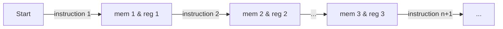


#### Machine-Code —— The Computer's Native Language

The computer engineer abstracts a particular calculation, or operation, of the CPU, into a series of instructions. These instructions are mapped to particular codes, and you are able to look them up in the user manual. For the computer users at that time, whenever they want to do specific calculations, they need to look up the corresponding code and input them into the computer. Note that we could also assign these codes to a specific number value and store them in our computer just like the data. This is how the **_machine code_** evolved, which is the "native" language for the computer.

Also, you can pre-write the machine codes into the computer and wait for the computer to read them, and execute them in order. A series of such instructions that are executed **in order** by the CPU is the **program**.

#### Compilation —— The bridge to the High-Level Languages

With the development of society, people's demand for higher performance of calculations was explodingly expanding. Fundamentally, there were 2 critical problems

- It's hard to simply enumerate all the instructions into codes.
- It's not convenient for the user to look up thousands of command codes.

To solve the second problem, the engineers tried to use some letters or words to replace the original number form of the code to increase the **readability**. One of the design of it is **Assembly Language**.

```s
main:
 pushq %rbp               # The address of where the calculation process happens
 movq %rsp, %rbp         
 subq $48, %rsp          # Allocate particular space for the calculation process. The process is happening on the address "rsp - 48"
 call __main
 movl $1, -4(%rbp)       # assign value 1 to the storage unit with the address "rbq - 4" 
 movl -4(%rbp), %eax     # Get 1 from the address "rbq - 4" and assign to address "eax"
 addl %eax, %eax         # Get value in "eax" and add it to"eax" (multiply by 2)
 addl $1, %eax           # Add 1 to "eax"
 movl %eax, -8(%rbp)     # Get the value in "eax" and copy it on the address "rbq - 8"
 movl $0, %eax           # Set 0 to the address "eax"
 addq $48, %rsp          
 popq %rbp               # Resume and wait for the next calculation process of other program
 ret
    
# So annoying if you need to type in these commands just to add two simple numbers!
```

Assembly Language does not solve the first questions, since each command in assembly is mainly a **one-to-one** map to the machine code, and it does not alter the nature of the machine codes.

The invention of the machine codes represents a "leap" from the specific hardware layer to the computer's organization and principle layer. After undergoing this first **abstraction** process, you are able to represent specific data, do calculations, and input or output them in a specific place, without caring about their specific physical electronic representation form.

Similar to the "first leap", our "second leap" is successfully saving us from the principle of the computer's organization layer. After undergoing the second abstraction process, we are able to focus more on the **logic** and the **flow** of our program beyond how they are specifically implemented.

```c
/**
* A C example codes
* You don't need to care about in which "address" does this calculation process occur
* You only foucus on the calculation process and the result
* Morever, the program becomes more readable and human-friendly~
*/
int main()
{
    int a;          
    int b = 1;      
    a = 2 * b + 1;  
    return 0;
}
```

We denote the programming language undergoing this "second leap" as **the high-level language**. C and C++ that we are going to learn both belong to this scope. Relatively, the programming languages that is not undergoing this process are defined as  **the low-level language**.

Unfortunately, the high-level languages could be directly read and implemented by the CPU. Recall that the CPU can only understand the **machine codes**. We need to find a way to "translate" the high-level language program into the machine codes, or otherwise inaccurately **executable files**.

**Compilation** is the process of this kind of translation or re-interpretation. The program that is doing this kind of translation is called the **compiler**. The principle of the compilation is such a large topic that we are not able to cover in this lecture notes. It's beneficial to simply _(but not accurately)_ understand the compilation process as a function.

We can rewrite our state machine in the context of C/C++:

- **State**: Heap and Stack of the program (will be introduced later)
- **Transition**: One line of code (statement)
- **Initial State**: main() function

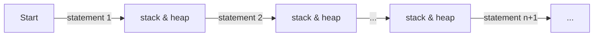


One can easily see that higher level state machine can be defined more universally. Depends on
different architecture, the lower level state machine can be different.

Now we can more clearly define the process of compilation:

> Compilation is a mapping from the higher level state machine to the lower level state machine.

 $\text{Compiling}: \{C,C^\text{++},...\} \mapsto \{\text{MachineCodes}\}$ 

With the following requirements:

1. Any _observable_ behavior of the higher level state machine should be preserved in the lower level state machine. i.e. system calls, inputs and outputs, etc.
2. User-enforced "not optimized" behaviors. i.e. volatile, load, store, inline assembly, etc.
3. The lower level state machine should _terminate_ if and only if the higher level state machine terminates.

Anything else is fine, such as

1. make your code run faster
2. make your code smaller

This is the process called **optimization**.

### Introduction to Our Tool-chain

We introduce this part brief by the order of our workflow.

#### Step 1: STM32CubeMX —— Pin-Out Configuration

One of the most important factors that differentiates us from COMP2011 is that we program on the embedded system. It invovles some _special_ configuration that could let our program **run on the MCU**. We are able to take advantage of the **template files** generated by the STM32CubeMX and program based on it.
In our C++ tutorial phase, you don't need to care about this session.

#### Step 2：Coding in VSCode

We write our codes on the VSCode. **However, we do not run our code in VSCode!**. Recall previous sections, compiler is a separate program.

#### Step 3: Compile the Codes

Just as the last section mentions, compiling is the process that "translates" our code written in C / C++ into the machine codes which could be directly executed by the CPU. The following are the  steps for us to achieve this:

- Open the VSCode and open the directory under our project path
- Use the shortcut **_"Control + `"_** to open the terminal
- Type in the following commands under the root of our project path

```shell
make -j
```

If you are able to see the info message as the followings, it means the compilation works fine.

```
...
arm-none-eabi-size build/xx_project.elf
   text    data     bss     dec     hex       filename
  22528     120   11904   34552    86f8       build/xx_project.elf  
arm-none-eabi-objcopy -O ihex build/xx_project.elf build/xx_project.hex
arm-none-eabi-objcopy -O binary -S build/xx_project.elf build/xx_project.bin
```

```"xx_project.elf", "xx_project.hex", "xx_project.bin"``` are the files that could be executed by MCU.
You are able to configure the compilation in the _Makefile_ under the generated project directory. However, **we do not recommend you to do so** as it's another complex topic.

#### Step 4: Download and Debug the Program with Ozone

**We run our Program on the MCU.** These steps could be separated into 2 parts:

- Flash the code into the MCU
- Debug
  

The Details are as follows:

1. Open the Ozone 

2. Select "File" on the up-left corner, and click "New"-"New Project Wizards"
   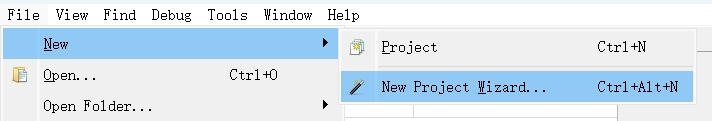

3. Configurate "Device", select "STM32F103C8", and then click "Next"
   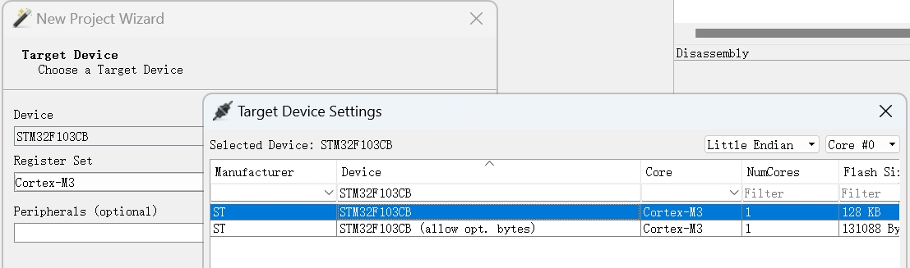

4. Select "Target Interface" as the option "SWD"
   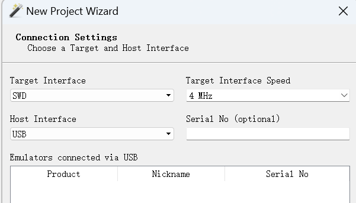

5. Select the ".elf" file of your project. Compared to the example below.
**Please select ".elf" instead of others under the "/build" directory  if you want to debug**

```shell
the_upper_stream_path_of_your_project/xx_project/build/xx_project.elf
```


6. Select "ELF Entry Point" and "Read From Base Address Vector Table"
   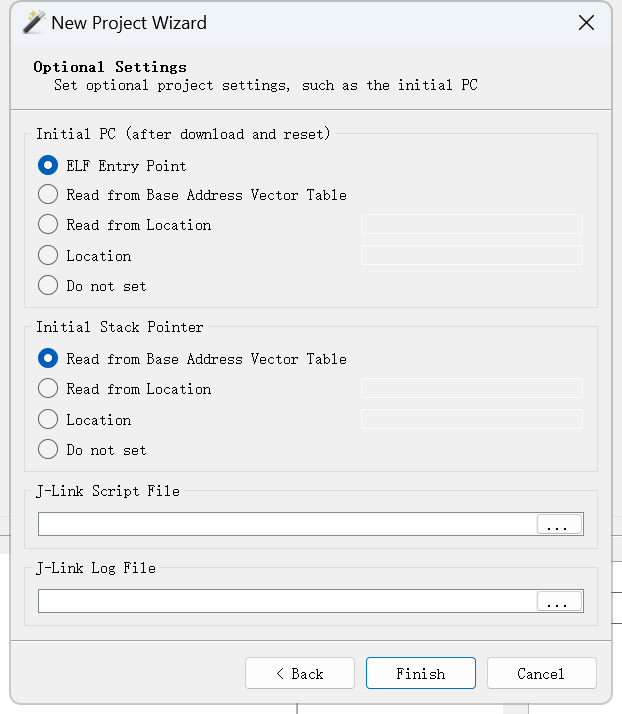
7. Click "Finish"
8. Connect your computer with the J-Link through the USB Interface. Connect the J-Link with the MCU.
   - _Jlink is our "debugger", or **debug probe** otherwise. It is the media between our computer and the MCU. **SWD / Serial Wire Debug** is the debugging protocol we use, which means, how our working computers "communicate" with MCU_
   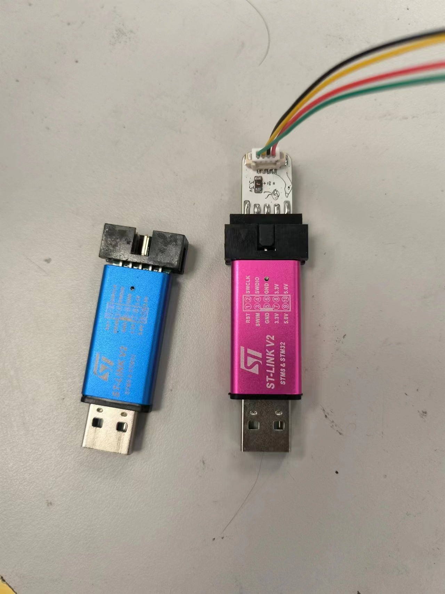
   - _Connect the MCU to your computer through the MCU_
   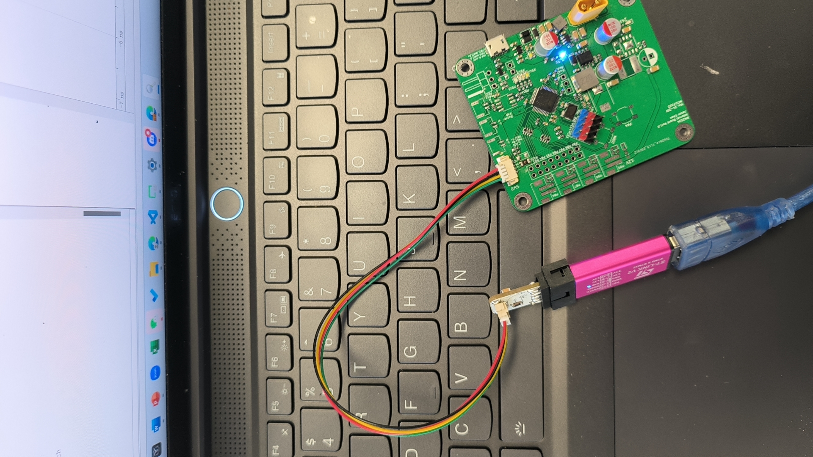
9. Click the green button on the up-left corner of the Ozone interface.
   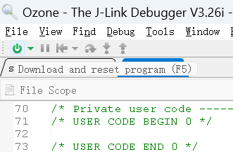
10. Continue until you see three green progress bars. Wait until the flashing process stops.
11. Click the green triangle button on the up-left corner of the Ozone interface and resume the halted program. Now you successfully start up your debugging process!
    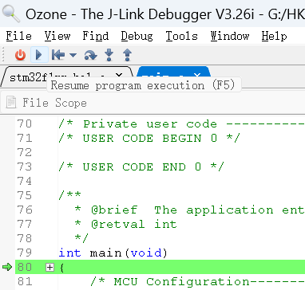

For a more detailed tutorial about using the Ozone, please refer to the ozone debugger usage tutorial PPT in 2022, which I have uploaded it on Google Drive:

Now since we have learnt our language to communicate with our MCUs, it's time for us to say "hello" to them!

### Say 'Hello World" to the Embedded System

Our journey began by blinking an "LED". You are able to download the template codes and try to play with it.

- Unzipped the file "RM2024-Tutorial", open the **directory**(not a single file) with VSCodes
- Open the file `main.c` in the explorer area on the left.

YOu might find the codes under the **main function**. It looks like this.

```c
/**
  * @brief  The application entry point.
  * @retval int
  */
int main(void)
{
    /* MCU Configuration--------------------------------------------------------*/
    
    /* Reset of all peripherals, Initializes the Flash interface and the Systick. */
    HAL_Init();

    /* Configure the system clock */
    SystemClock_Config();

    /* Initialize all configured peripherals */
    MX_GPIO_Init();
    MX_DMA_Init();
    MX_CAN_Init();
    MX_TIM1_Init();
    MX_TIM2_Init();
    MX_TIM3_Init();

    /* USER CODE BEGIN 2 */
    /* Intialize the LED and Buzzer module*/
    Tick_Init();
    Buzzer_Init();
    WS2812_Init();
    /* USER CODE END 2 */
    /* USER CODE BEGIN 3 */
    /*============= Your code begins here ============== */
  
    blink(0, 255, 0, 0); // We blink the red LED in the first in red!
    
    /*============= Your code ends here =============== */
    while (1);
    /* USER CODE END 3 */
}
```

This is where our journey begin. It is the fact that ```main()``` is every program's **entry point**, that is, where every program starts.

You might now get very confused about those strange lines of names with strange bracket, like ```HAL_Init()```, ```SystemClock_Config()```. Don't worry, we don't need to know too much about them at this stage. Ignoring those "useless" parts, all you need to consider is the following.

```c
/**
  * @brief  The application entry point.
  * @retval int
  */
int main(void)
{
    //....//
 // Something you don't need to care now // 
 //....//

    /*============= Your code begins here ============== */
  
    blink(0, 255, 0, 0); // We blink the red LED in the first in red!
    
    /*============= Your code ends here =============== */
    while (1);
    /* USER CODE END 3 */
}
```

This code blinks the <font color = Red> red </font> LED at the index 1.

#### RGB

RGB _(red, green, and blue)_ refers to a system representing the colors used on a digital display screen. You can simply regard _our_ rgb value as the form of the following vector:

 $\left(
\begin{matrix}
r \\
g  \\  
b  
\end{matrix}
\right)\in\N^3\,\,\,\,\,\,\,\,\, r\in [0, 255],\, g\in [0, 255],\, b\in[0, 255];$ 
The principle of the color mixture tells us we are able to use a linear combination of three basic colors (red, blue, and green) to represent different colors. This is why we could control these three values, that is, the **density** of each basic color, to control our desired color and the mixture of the basic colors.
**Some Interesting Combination of RGB Values:**
<font color = RED >(255, 0, 0)</font> <font color = ORANGE >(255, 128, 0)</font>  <font color =  YELLOW>(255, 255, 0) </font> <font color = GREEN>(0, 255, 0) </font> <font color = CYAN>(0, 255, 255) </font> <font color = BLUE> (0, 0, 255) </font> <font color = PURPLE> (255, 0, 255)</font>

```c
/**
  * @brief  The application entry point.
  * @retval int
  */
int main(void)
{
    //....//
 // Something you don't need to care now // 
 //....//

    /*============= Your code begins here ============== */
  
    blink(0, 255, 0, 0); // Blink red!
    HAL_Delay(1000);     // Delay for 1000ms
    blink(255, 128, 0);  // Blink orange!
    HAL_Delay(1000);     // Delay for 1000ms
    blink(255, 255, 0);  // Blink yellow!
    HAL_Delay(1000);  // Delay for 1000ms
    blink(0, 255, 0);    // Blink green!
    HAL_Delay(1000);  // Delay for 1000ms
    blink(0, 255, 255);  // Blink cyan!
    HAL_Delay(1000);  // Delay for 1000ms
    blink(0, 0, 255);    // Blink blue!
    HAL_Delay(1000);  // Delay for 1000ms
    blink(255, 0, 255);  // Blink purple!

    /*============= Your code ends here =============== */
    while (1);
    /* USER CODE END 3 */
}
```

Don't forget to ```make -j``` in the terminal, download the program to MCU, and play with the LED.

### Data types

#### Represent Real Number as an Example

**Facts**:

Recall from the above ——

1. Data are stored in memory as a _sequence of bits_.
2. Memory is _finite_.
3. We need different data types to represent different data.

#### How Computers Represent an Infinite Decimal


The decimal represented under the form like this is **float**. The computer memory is **finite**, but the data such as real numbers is **infinite**. One of the most important topics in Computer Science is to use the finite data structure to approximate the infinite value.

As the chinese philosopher Zhuangzi said:

> 以有涯隨無涯，殆已！
>
> _If you use the finite to pursue the infinite, you will be in danger._


#### Recap on Memory


Computer memory is a sequence of bits, each of which can be either 0 or 1.

**A Byte** is an alignment of 8 bits.

Each memory block can be analogous to houses in a street, and each byte is a house.
The **unique** sequential ID of each house is called the **address** of the house.


#### Other Data Types

In the cold and cruel world of only 1s and 0s, the only light of human civilization is the
ways we choose to face the world. The way we choose to represent data is called a
**data type**. The most common data types are:


- A signed integer is one that can represent a negative number; an unsigned integer will
never be interpreted as negative, so it can represent a wider range of positive numbers.
Most compilers assume signed if unspecified.
- There are actually 3 integer types: **short, int, and long**, in non-decreasing order of
size. The same goes for the 3 floating point types, **float, double, and long double**.
- The sizes/ranges for each type are not fully standardized.


#### Declare and Initialize Variables

```cpp
/**
* @brief The program entry point
* @brief Initalize data
*/
int main()
{
    Data_type variable_name = value;
    float note = 440.0;
    float pi = 3.1415926;
}
```

By Declaring a variable, we are telling the compiler to **allocate** a memory block, that is the houses of the
appropriate size and type for us to store data. The variable name is used to refer to the
memory block (the house). By holding this key in our hand, we could easily visit, manipulate, or even exile our "guest" that lives in the "house".
The _key_ is not unique. We are going to cover this part in L3 by introducing "pointer".


Don't be scared by the picture. You don't need to understand the details of the fundamental principles of "pointers".

### Operators(Mandatory)

Operators are symbols that tell the compiler to perform specific mathematical or logical
manipulations. We will just list some of the most common ones here. It provides us the _"tool"_ to manipulate our _"guest"_ lives in the _"house"_.

| Operator | Description    | Example |
| -------- | -------------- | ------- |
| `+`      | Addition       | `a + b` |
| `-`      | Subtraction    | `a - b` |
| `*`      | Multiplication | `a * b` |
| `/`      | Division       | `a / b` |
| `%`      | Modulus        | `a % b` |
| `=`      | Assignment     | `a = b` |

**Note:**

- `=` doesn't mean mathematical equivalence $“ \equiv ”$
- `a = b` means you assign the value in the variable b to the variable a, which means, you first exile the _"guestB"_ lives in _"house b"_, then let the _"guestA_" lives in _"house a"_ copy himself, and finally invite his _"copy"_ into the empty _"house b"_.

```c
/*
* @brief The program's entry point
* @brief Assign operator demonstration
*/
int main()
{
 int guest_A = 1;    //  You assign a value "1" to guest A and allocate a "house_a" for him
 int guest_B = 2;    //  You assign a value "2" to guest B and allocate a "house_a" for him
 guest_A = guest_B;  //  You exile the guest A from the house_a and let a "copy" of guest B into the house_b
}
```

```c
/**
* @brief The program's entry point
* @brief Data calculating, a fibonacci array
*/
int main()
{
 int a = 0;
 int b = 1;
 int c;
 c = a + b; 
 a = b + c; 
 b = c + a; 
 c = a + b; 
 a = b + c; 
 b = c + a; 
 c = a + b; 
 a = b + c; 
 b = c + a; 
 c = a + b; 
 a = b + c; 
 b = c + a; 
 //...//
 //...//
 //...//
 //* You are able to write this array more neatly after you understand "loop" in the next lecture *//
}
```

| Operator | Description | Example    |
| -------- | ----------- | ---------- |
| `&&`     | Logical AND | `a && b`   |
| `\|\|`   | Logical OR  | `a \|\| b` |
| `!`      | Logical NOT | `!a`       |

- In C/C++, we use the bit "1" to represent a state as "true" and use the bit "0” to represent a state as "false".

```c
/**
* @brief The program entry point
* @brief The Logical Operator in C/C++
*/
int main()
{
 int False_ = 0;
 int True_ = 1;
 
 int state1 = False_ && True;  // false
 int state2 = True_ && True_;  // true
 int state3 = False_ && False; // false

 int state4 = False_ || True;  // true
 int state5 = True_ || True_;  // true
 int state6 = False_ || False; // false

 int state7 = !False_     // true
 int state8 = !True_     // false
 /* Try to give you taste a bout COMP 2711(H) "logic" part */
} 
```

| Operator | Description           | Example  |
| -------- | --------------------- | -------- |
| `==`     | Equal                 | `a == b` |
| `!=`     | Not equal             | `a != b` |
| `>`      | Greater than          | `a > b`  |
| `<`      | Less than             | `a < b`  |
| `>=`     | Greater than or equal | `a >= b` |
| `<=`     | Less than or equal    | `a <= b` |

For these types of operators, you can regard it as a function with two variables or data input, outputting a logistic result "0" or "1".

- **Don't mistake the equality operator `==` with the assignment operator `=`. In this case, the equal operator `==` behaves more like mathematic equivalence** $" \equiv "$.
